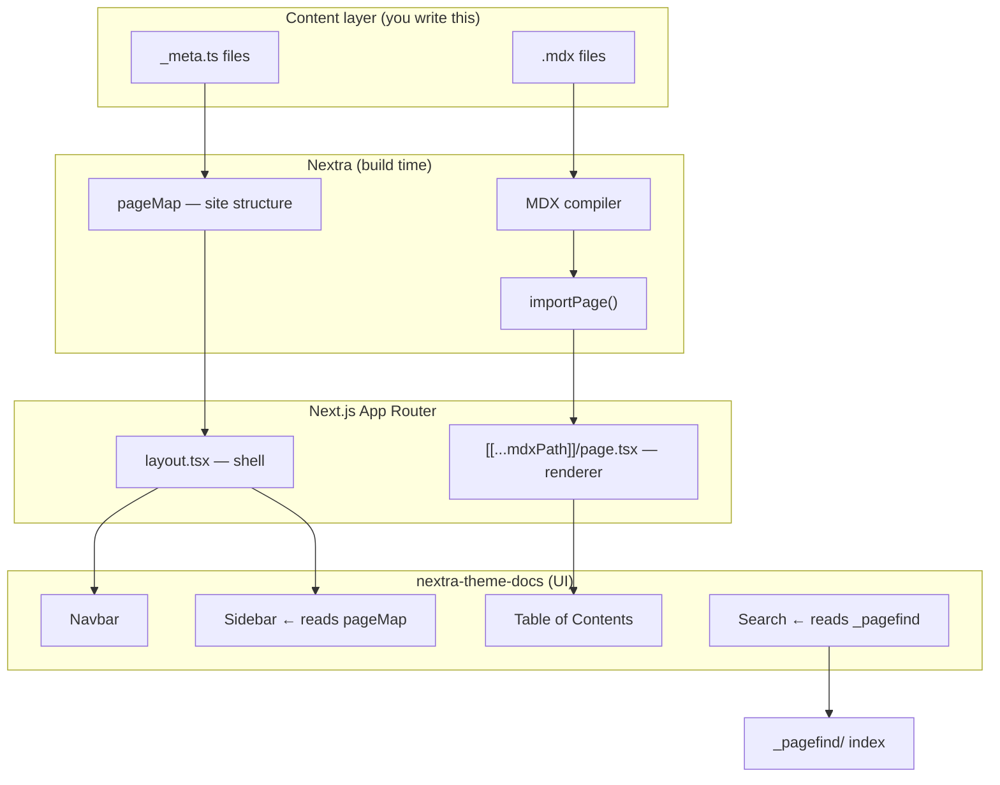
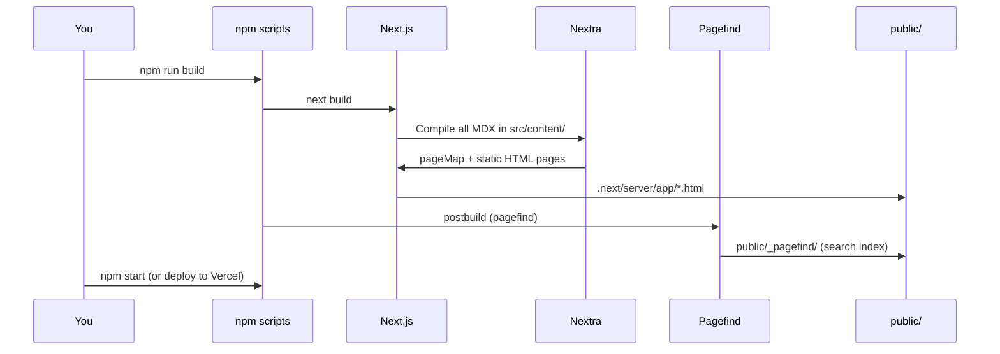

# IoT Pioneer Docs — Build Guide

This document explains **how this documentation site is built**, **how every part connects**, and **how you can build your own** from scratch.

It is written for learning — read it alongside the actual files in this repository.

---

## Table of contents

1. [What you are building](#1-what-you-are-building)
2. [Technology stack](#2-technology-stack)
3. [Project folder structure](#3-project-folder-structure)
4. [The big picture — how everything connects](#4-the-big-picture--how-everything-connects)
5. [Step-by-step: what happens when someone opens a page](#5-step-by-step-what-happens-when-someone-opens-a-page)
6. [The configuration layer](#6-the-configuration-layer)
7. [The app shell — layout and theme](#7-the-app-shell--layout-and-theme)
8. [The page router — one file serves all docs](#8-the-page-router--one-file-serves-all-docs)
9. [Content and navigation — where your writing lives](#9-content-and-navigation--where-your-writing-lives)
10. [MDX — markdown with superpowers](#10-mdx--markdown-with-superpowers)
11. [Search — how Pagefind fits in](#11-search--how-pagefind-fits-in)
12. [Styling and branding](#12-styling-and-branding)
13. [Build and deploy pipeline](#13-build-and-deploy-pipeline)
14. [How to add a new documentation page](#14-how-to-add-a-new-documentation-page)
15. [How to add a new section (folder with nested pages)](#15-how-to-add-a-new-section-folder-with-nested-pages)
16. [Build your own docs site from zero](#16-build-your-own-docs-site-from-zero)
17. [Glossary](#17-glossary)

---

## 1. What you are building

This is **not** a traditional React app with dozens of pages. It is a **static documentation site** built with:

- **Next.js** — the web framework (routing, build, deployment)
- **Nextra** — a plugin that turns Markdown/MDX files into a full docs site
- **nextra-theme-docs** — the pre-built docs UI (sidebar, navbar, search box, table of contents)

You write content in `.mdx` files. Nextra turns them into pages, builds the sidebar automatically, and handles search indexing.

---

## 2. Technology stack

| Layer | Tool | Role |
| ----- | ---- | ---- |
| Framework | Next.js 16 | App Router, SSR/SSG, deployment |
| Docs engine | Nextra 4 | MDX compilation, page map, search hooks |
| Docs UI | nextra-theme-docs | Sidebar, navbar, footer, TOC, dark mode |
| Content format | MDX | Markdown + JSX (React components in docs) |
| Styling | Tailwind CSS 4 + custom CSS | Brand colors, video cards, overrides |
| Search | Pagefind | Indexes HTML after build; client-side search |
| Language | TypeScript | Type-safe config and `_meta.ts` files |

---

## 3. Project folder structure

```
iot-pioneer-docs/
├── public/                    # Static assets (logo, favicon, search index output)
│   ├── IOT_DATA_HUB.png
│   └── _pagefind/             # Generated at build time — do not edit by hand
│
├── scripts/
│   └── patch-nextra.mjs       # Small compatibility fix run after npm install
│
├── src/
│   ├── app/                   # Next.js App Router — the "engine room"
│   │   ├── layout.tsx         # Site shell: navbar, sidebar, footer, theme
│   │   ├── globals.css        # Your custom styles (brand colors, cards)
│   │   ├── not-found.tsx      # 404 page
│   │   └── [[...mdxPath]]/
│   │       └── page.tsx       # ONE route file that renders ALL doc pages
│   │
│   ├── content/               # ALL documentation lives here
│   │   ├── _meta.ts           # Top-level sidebar order and labels
│   │   ├── index.mdx          # Homepage → URL: /
│   │   ├── getting-started.mdx
│   │   ├── connect-devices/   # Folder = collapsible sidebar section
│   │   │   ├── _meta.ts       # Child page order inside this folder
│   │   │   ├── index.mdx      # Section overview → URL: /connect-devices
│   │   │   ├── arduino-library.mdx
│   │   │   └── ...
│   │   ├── dashboards/
│   │   ├── alerts/
│   │   └── ...
│   │
│   └── data/
│       └── videos.ts          # Data file imported by MDX (video cards)
│
├── mdx-components.js          # Registers MDX components (headings, code blocks, wrapper)
├── next.config.mjs            # Next.js + Nextra config, URL redirects
├── package.json               # Dependencies and scripts
└── BUILD-GUIDE.md             # This file
```

### Key idea

| Folder | You edit it for… |
| ------ | ---------------- |
| `src/content/` | Writing and organizing documentation |
| `src/app/layout.tsx` | Navbar, footer, theme colors, sidebar behavior |
| `src/app/globals.css` | Custom visual design |
| `src/data/` | Shared data (lists, configs) used inside MDX |
| `next.config.mjs` | Redirects, Nextra options |
| `public/` | Images and files served as-is |

You almost **never** create new files in `src/app/` when adding docs — you add `.mdx` files under `src/content/`.

---

## 4. The big picture — how everything connects



**In plain English:**

1. You write `.mdx` files and `_meta.ts` navigation config.
2. Nextra scans `src/content/`, builds a **page map** (tree of all routes), and compiles MDX to React.
3. `layout.tsx` wraps every page with the docs theme and passes the page map to the sidebar.
4. `page.tsx` is a single catch-all route — it loads whichever MDX file matches the URL.
5. After `npm run build`, Pagefind indexes the HTML and writes search files to `public/_pagefind/`.

---

## 5. Step-by-step: what happens when someone opens a page

Example: user visits `/connect-devices/arduino-library`

```
Browser requests /connect-devices/arduino-library
        │
        ▼
Next.js matches route: src/app/[[...mdxPath]]/page.tsx
        │
        ▼
mdxPath = ["connect-devices", "arduino-library"]
        │
        ▼
importPage(["connect-devices", "arduino-library"])
  → loads src/content/connect-devices/arduino-library.mdx
  → returns: MDXContent, toc, metadata, sourceCode
        │
        ▼
Wrapper (from mdx-components.js) renders:
  - Page title and description (from frontmatter)
  - Table of contents (right sidebar)
  - MDX body (headings, code, tables, links)
        │
        ▼
layout.tsx wraps everything with:
  - Navbar (logo, Pricing link, Platform link)
  - Sidebar (built from pageMap + _meta.ts)
  - Footer
```

The sidebar highlights **Arduino Library** because Nextra knows the active route from the page map.

---

## 6. The configuration layer

### `next.config.mjs`

```js
import nextra from 'nextra'

const withNextra = nextra({})   // Wraps Next.js with Nextra

const nextConfig = {
  async redirects() {
    return [
      { source: '/devices', destination: '/connect-devices', permanent: true },
      // ...
    ]
  },
}

export default withNextra(nextConfig)
```

- `nextra({})` — activates Nextra. Options like `search: false` would go inside `{}`.
- `withNextra(nextConfig)` — merges your Next.js settings with Nextra's.
- `redirects` — old URLs still work after you reorganize content.

### `package.json` scripts

| Script | What it does |
| ------ | ------------ |
| `dev` | Start development server with hot reload |
| `build` | Compile all pages to static HTML |
| `postbuild` | Run Pagefind to index HTML → `public/_pagefind/` |
| `start` | Serve the production build |
| `postinstall` | Run `patch-nextra.mjs` (Zod compatibility fix) |

### `mdx-components.js`

Tells MDX which React components to use for headings, code blocks, links, and the page **wrapper** (the layout around each article):

```js
import { useMDXComponents as getThemeComponents } from 'nextra-theme-docs'

const themeComponents = getThemeComponents()

export function useMDXComponents(components) {
  return { ...themeComponents, ...components }
}
```

You extend this file when you want custom MDX components (e.g. a `<Callout>` block).

---

## 7. The app shell — layout and theme

File: `src/app/layout.tsx`

This is the **most important React file** in the project. It defines everything that appears on **every page**.

### What it imports

| Import | Purpose |
| ------ | ------- |
| `Layout`, `Navbar`, `Footer` from `nextra-theme-docs` | Pre-built docs chrome |
| `Head` from `nextra/components` | Theme colors, meta tags |
| `getPageMap` from `nextra/page-map` | Builds sidebar navigation tree |
| `globals.css` | Your custom styles |
| `nextra-theme-docs/style.css` | Default theme styles |

### What it configures

```tsx
<Layout
  navbar={navbar}           // Top bar with logo and links
  pageMap={await getPageMap()}  // Sidebar structure — async, server-side
  footer={footer}
  darkMode={true}
  copyPageButton={false}    // Hide "Copy page" button
  editLink={null}           // Hide "Edit on GitHub"
  feedback={{ content: null }}  // Hide feedback link
  sidebar={{
    autoCollapse: true,           // Collapse inactive folders
    defaultMenuCollapseLevel: 1,  // How many folder levels start expanded
  }}
>
  {children}   // The actual doc page content
</Layout>
```

### Navbar and footer

These are **React components you define yourself** and pass into `Layout`:

- **Navbar** — logo, link to iotdatahub.rw, Pricing link
- **Footer** — copyright, email, external links

This is how you brand the site without forking the entire theme.

---

## 8. The page router — one file serves all docs

File: `src/app/[[...mdxPath]]/page.tsx`

The folder name `[[...mdxPath]]` is a Next.js **optional catch-all route**:

| URL | `mdxPath` param |
| --- | --------------- |
| `/` | `[]` or undefined → `index.mdx` |
| `/getting-started` | `["getting-started"]` |
| `/connect-devices/arduino-library` | `["connect-devices", "arduino-library"]` |

### Three exports in this file

```tsx
// 1. Tell Next.js every URL to pre-render at build time
export const generateStaticParams = generateStaticParamsFor('mdxPath')

// 2. Set <title> and meta description per page (from MDX frontmatter)
export async function generateMetadata(props) {
  const { metadata } = await importPage(params.mdxPath)
  return metadata
}

// 3. Render the page
export default async function Page(props) {
  const { default: MDXContent, toc, metadata, sourceCode } =
    await importPage(params.mdxPath)

  return (
    <Wrapper toc={toc} metadata={metadata} sourceCode={sourceCode}>
      <MDXContent />
    </Wrapper>
  )
}
```

**You rarely edit this file** after initial setup. All new docs are added in `src/content/`.

---

## 9. Content and navigation — where your writing lives

### File → URL mapping

Nextra uses **file-based routing** inside `src/content/`:

| File | URL |
| ---- | --- |
| `index.mdx` | `/` |
| `getting-started.mdx` | `/getting-started` |
| `connect-devices/index.mdx` | `/connect-devices` |
| `connect-devices/arduino-library.mdx` | `/connect-devices/arduino-library` |

### `_meta.ts` — sidebar control

Each folder can have a `_meta.ts` that controls **order**, **labels**, and **structure**.

**Root** (`src/content/_meta.ts`):

```ts
import type { MetaRecord } from 'nextra'

const meta: MetaRecord = {
  index: 'Introduction',
  'getting-started': 'Getting Started',
  '---': { type: 'separator', title: 'How It Works' },  // Visual divider
  'connect-devices': 'Connect Devices',                  // Folder → shows arrow
  dashboards: 'Dashboards',
  // ...
}

export default meta
```

**Inside a folder** (`src/content/connect-devices/_meta.ts`):

```ts
const meta: MetaRecord = {
  'supported-hardware': 'Supported Hardware',
  'arduino-library': 'Arduino Library',
  'rest-api': 'REST API',
}
export default meta
```

### `_meta.ts` entry types

| Type | Example | Effect |
| ---- | ------- | ------ |
| String | `'getting-started': 'Getting Started'` | Page title in sidebar |
| Folder name | `'connect-devices': 'Connect Devices'` | Collapsible group with arrow |
| Separator | `{ type: 'separator', title: '...' }` | Horizontal section label |
| Hidden page | `{ display: 'hidden' }` | Page exists but not in sidebar |

### Folder overview pages (`asIndexPage`)

When a folder has an `index.mdx` with `asIndexPage: true` in frontmatter:

- The folder appears in the sidebar **with a collapse arrow**
- Clicking the folder name opens the overview page at `/connect-devices`
- Child pages nest underneath

```mdx
---
title: Connect Devices
asIndexPage: true
---
```

Do **not** add `index` to the folder's `_meta.ts` — Nextra handles it automatically.

---

## 10. MDX — markdown with superpowers

### Frontmatter (YAML at the top)

Every page starts with metadata between `---` lines:

```mdx
---
title: Arduino Library
description: Install and use the IoTDataHub library in Arduino IDE.
---

# Arduino Library

Your content here...
```

- `title` → page heading and browser tab (via `generateMetadata`)
- `description` → SEO meta description

### Standard markdown

Headings, lists, tables, code blocks, and links all work as in normal Markdown.

### React inside MDX

File: `src/content/resources/videos.mdx`

```mdx
import { videoTutorials } from '../../data/videos'

# Video Tutorials

<div className="iot-video-grid">
  {videoTutorials.map((video) => (
    <article key={video.id} className="iot-video-card">
      ...
    </article>
  ))}
</div>
```

This pattern:

1. Keeps **data** in `src/data/videos.ts` (easy to update)
2. Keeps **presentation** in `globals.css` (`.iot-video-grid`, `.iot-video-card`)
3. Uses **MDX** to loop and render cards

Data file (`src/data/videos.ts`):

```ts
export const videoTutorials = [
  { id: '1', title: '...', youtubeId: '...', ... },
]
```

---

## 11. Search — how Pagefind fits in

Nextra 4 uses **Pagefind** instead of a server-side search engine.

### Why search did not work before

Search requires a **search index** that only exists **after building**:

```
npm run build     → Next.js writes HTML to .next/server/app/
npm run postbuild → Pagefind reads that HTML, writes index to public/_pagefind/
```

The search box in the navbar loads `/_pagefind/pagefind.js` from `public/`.

### Development tip

Search is empty in `npm run dev` until you run at least one build:

```bash
npm run build
npm run dev
```

Or use production mode:

```bash
npm run build
npm start
```

### Windows note

Pagefind needs the platform binary. This project includes:

```json
"optionalDependencies": {
  "@pagefind/windows-x64": "^1.3.0"
}
```

On Linux/macOS deploy (Vercel, etc.), the matching optional package installs automatically.

---

## 12. Styling and branding

### Three layers of styles

| Layer | File | Purpose |
| ----- | ---- | ------- |
| Theme defaults | `nextra-theme-docs/style.css` | Sidebar, typography, dark mode |
| Brand tokens | `src/app/globals.css` | CSS variables (`--iot-orange`, etc.) |
| Theme colors | `<Head color={...} />` in layout.tsx | Nextra accent color (orange hue 36) |

### Custom CSS classes

Define classes in `globals.css`, use them in MDX or layout:

```css
:root {
  --iot-orange: #ffab31;
}

.iot-logo {
  color: var(--iot-orange);
  font-weight: 700;
}
```

```tsx
<span className="iot-logo">IoTDataHub</span>
```

### Overriding Nextra content styles

```css
:not(.dark) .nextra-content a {
  color: var(--iot-blue);
}
```

---

## 13. Build and deploy pipeline



### What gets deployed

- Compiled Next.js app
- `public/` assets including `_pagefind/`
- No database, no server-side search — fully static-friendly

---

## 14. How to add a new documentation page

**Example:** add a page "Wi-Fi Setup" under Connect Devices.

### Step 1 — Create the MDX file

`src/content/connect-devices/wifi-setup.mdx`

```mdx
---
title: Wi-Fi Setup
description: Configure Wi-Fi on ESP32 before connecting to IoTDataHub.
---

# Wi-Fi Setup

Your content...
```

URL will be: `/connect-devices/wifi-setup`

### Step 2 — Register it in the folder's `_meta.ts`

`src/content/connect-devices/_meta.ts`

```ts
const meta: MetaRecord = {
  'supported-hardware': 'Supported Hardware',
  'wifi-setup': 'Wi-Fi Setup',        // ← add this line
  'arduino-library': 'Arduino Library',
  'rest-api': 'REST API',
}
```

### Step 3 — Link to it from other pages

```mdx
See [Wi-Fi Setup](/connect-devices/wifi-setup) for details.
```

### Step 4 — Verify

```bash
npm run dev
```

Open the sidebar — the new page appears under **Connect Devices**.

---

## 15. How to add a new section (folder with nested pages)

**Example:** add a "Security" section.

### Step 1 — Create the folder and files

```
src/content/security/
├── _meta.ts
├── index.mdx          # Overview (use asIndexPage: true)
├── api-keys.mdx
└── encryption.mdx
```

### Step 2 — `_meta.ts` inside the folder

```ts
const meta: MetaRecord = {
  'api-keys': 'API Keys',
  encryption: 'Encryption in Transit',
}
export default meta
```

### Step 3 — Overview page

`src/content/security/index.mdx`

```mdx
---
title: Security
asIndexPage: true
---

# Security

Overview of how IoTDataHub protects your data...
```

### Step 4 — Register in root `_meta.ts`

```ts
const meta: MetaRecord = {
  // ...existing entries...
  security: 'Security',
}
```

Sidebar will show **Security** with an arrow and nested children.

---

## 16. Build your own docs site from zero

### Minimal steps

```bash
# 1. Create Next.js app
npx create-next-app@latest my-docs --typescript --app

# 2. Install Nextra
npm install nextra nextra-theme-docs

# 3. Configure next.config.mjs
#    (wrap config with nextra())

# 4. Create src/content/ with index.mdx

# 5. Create src/app/layout.tsx with Layout, Navbar, getPageMap()

# 6. Create src/app/[[...mdxPath]]/page.tsx with importPage()

# 7. Create mdx-components.js

# 8. Add search
npm install -D pagefind
# Add postbuild script to package.json

# 9. Run
npm run dev
```

Official references:

- [Nextra 4 documentation](https://nextra.site)
- [Nextra meta files (_meta.ts)](https://nextra.site/docs/file-conventions/meta-file)
- [Nextra search setup](https://nextra.site/docs/guide/search)
- [Next.js App Router](https://nextjs.org/docs/app)

### What makes *this* project different from a vanilla Nextra starter

| Customization | Where |
| ------------- | ----- |
| IoTDataHub branding | `layout.tsx`, `globals.css`, logo in `public/` |
| Nested doc sections | Multiple folders under `src/content/` |
| Video tutorial grid | `src/data/videos.ts` + MDX + CSS |
| URL redirects | `next.config.mjs` |
| No copy/edit/feedback buttons | `layout.tsx` Layout props |
| Zod compatibility patch | `scripts/patch-nextra.mjs` |
| Orange brand theme | `<Head color={...} />` + CSS variables |

---

## 17. Glossary

| Term | Meaning |
| ---- | ------- |
| **App Router** | Next.js routing system using the `app/` folder |
| **Catch-all route** | `[[...mdxPath]]` — one route matching many URL paths |
| **MDX** | Markdown + JSX — write React inside `.mdx` files |
| **pageMap** | Tree structure of all pages — powers the sidebar |
| **`_meta.ts`** | Config file controlling sidebar order and labels |
| **Frontmatter** | YAML metadata at the top of an MDX file (`---`) |
| **SSG** | Static Site Generation — pages built at compile time |
| **Pagefind** | Static search indexer — runs after `next build` |
| **Wrapper** | React component wrapping each page (title, TOC, pagination) |
| **asIndexPage** | Makes a folder's `index.mdx` the section landing page |

---

## Quick reference — files you will edit most often

| Task | File(s) to edit |
| ---- | --------------- |
| Write a doc page | `src/content/**/*.mdx` |
| Change sidebar order | `src/content/**/_meta.ts` |
| Change navbar/footer | `src/app/layout.tsx` |
| Change colors/styles | `src/app/globals.css` |
| Add URL redirect | `next.config.mjs` |
| Add shared data | `src/data/*.ts` |
| Fix search | Run `npm run build` (generates index) |

---

*This guide describes the IoT Pioneer Docs project as of the current structure. When in doubt, read the file mentioned here and trace how it connects to the others.*
